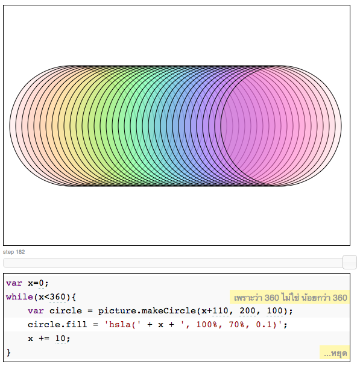
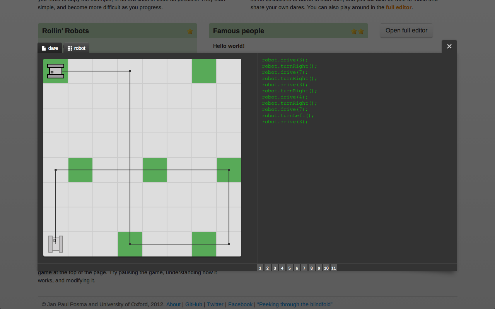
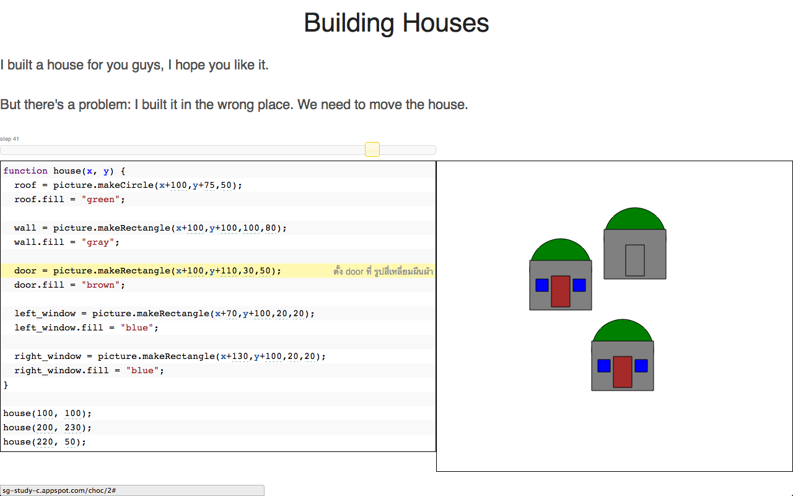
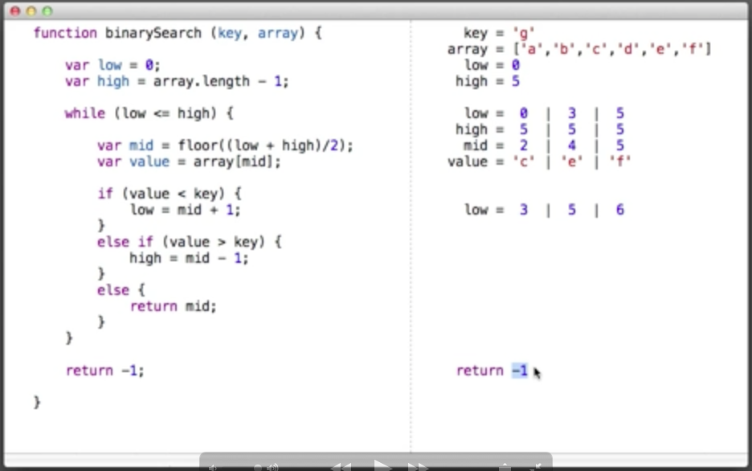

Over the past year, I’ve been fortunate enough to have a rather interesting and fun job: teaching C to 11th grade students in Thailand. It was also during this time period that I came across Bret Victor’s article [*Learnable Programming*](http://worrydream.com/LearnableProgramming). I found Victor’s approach to visualizing systems very useful for teaching students whose native language wasn’t English.

## How I got here

My university has a relationship with a couple of Thai private schools. Every year they send a few dozen graduates to Thailand to teach English for a year. After being invited back for a second year, I realized that there was an 11th grade programming course available, and asked if I could be placed there instead of an English reading/math/science course.

My new co-teacher had been teaching the class for a couple years already. She was also the coach for the school’s Robotics team (as well as the school’s sysadmin), and thus wasn’t available to teach for much of the first couple months. This left me in charge of creating lesson plans.

## Teaching C as a Foreign Language

I had two big big problems when making lesson plans. One was that the curriculum’s language was C (a topic for another day). The other was that I had to teach in English.

Programming is hard enough when learned in one’s native language. Although my students had been learning English since 1st grade, it still took effort to parse what I was saying. It’s unfair to expect students to gain an intuition about programming while being hampered by both foreign language lessons and a programming language with unintuitive syntax.

What I needed was a way for my students to understand my lessons, even if they didn’t understand me. I began looking for ways to visualize the ideas in my lessons.

My first attempts at doing this involved making a reference website with example programs and animations showing their execution. These were helpful for some students, but they were a crude solution compared to the tools I began using in my second semester.

## Fresh Air

At the end of the first semester, fullstack.io released [Choc](http://fullstack.io/choc), a browser-based coding environment based on Bret Victor’s [*Learnable Programming*](http://worrydream.com/LearnableProgramming). Choc’s goal is to help programmers understand what their code is doing. It achieves this by using interactive numbers, inline annotations, timelines and the ability to "scrub through" the execution of a piece of code.

This was my first time hearing about the *Learnable Programming* article, and I saw an immediate connection between the problems I was having reaching my students, and the ideas Bret Victor was discussing. If you haven’t read the article, I’d advise you to at least read the introduction before going forward. This article turned my brain upside down.

However, now I had a new problem: Many of the tools being built around this philosophy were written for Javascript. The school’s curriculum was based on C.

After some talks with my co-teacher (and a demo of Choc running with Thai annotations) we decided to compromise: I would start by teaching a few weeks of Javascript in order to make use of these tools. I would cover basic control structures like if-else, loops and functions (things that look syntactically similar in C). After that we would transition to C, teach about types, and move on from there.

Around this time I also found [jsdares](http://jsdares.com), a series of coding challenges whose environment was similarly inspired. jsdares also has many of Choc’s visualization features, but also takes cues from Seymour Papert’s work with [the LOGO Turtle](http://www.youtube.com/watch?v=BTd3N5Oj2jk). Students learn to program by using simple commands to guide a robot. They can reason about how the robot should move by thinking about how they would move. This allows them to solve problems using reasoning skills they already have.

I used the first track of dares on jsdares’ homepage as the basis for my first lesson (while I was getting Choc set up). I would give each dare a short introduction, and then have my students tell me what to do next. We would work through the dares on the projector as a class, although many students went ahead and solved the problems on their own.

The difference from my previous lessons was staggering. Students were **volunteering** to answer questions. When they made mistakes, the live feedback made it clear **why** something was an error. Rather than popping up a cryptic error message, the environment simply showed what was happening, making it easier to tell where things went off the rails.

jsdares also gets points for having a really well thought out learning curve. The first time I ran through the challenges I thought that there were too many "easy" ones in the beginning. The classroom proved me wrong: each dare builds on the one before it, and concepts are introduced and used in a really well thought out pattern.

When we got around to composing functions, the students not only understood function syntax, but also **why we use functions**. Many students rushed ahead, finishing the challenges and doing the challenges I didn’t get around to teaching. When we finished, they played around with the Breakout clone on the front page, changing the size of the bat and the blocks to make the game look how they wanted (one kid even got the bat to move underneath the ball so that the game played itself).

The next week I had set up Choc [on my website](http://sg-study-c.appspot.com/choc) and localized the annotations to Thai to make them more helpful. My first lesson involved teaching steps of abstraction, using an example I pretty much ripped straight out of Victor’s article:

1. I’d give them a house made of many parts, and tell them to move it around.
2. I’d have them use variables to make it easier to move the house as a single unit.
3. I had them abstract the code into a function so they could make more than one house.
4. I had them use a loop to make 10 houses in a row.

Once again I found that the students were more inclined to tinker with the code I gave them. They completed the lesson just fine, but when I came around to look at their work, many of them had houses with huge roofs and pink windows. These were the kinds of kids who would normally play flash games while I was teaching; I consider this variety of goofing off to be a significant improvement.

## The console problem

I did one more lesson each with jsdares and Choc. In these lessons, I tried using a pseudo-terminal to get my students used to the idea of writing to a console. While these lessons were still effective, I’ve come to realize that the console has serious limitations for teaching.

We generally use the console for teaching algorithms, like this one:

"Input a list of numbers, output the maximum of the numbers."

This idea can be hard to represent visually, so we generally go for the more "pure" symbolic approach: dealing with the numbers themselves with no distractions.

However, the console is actually ill-suited to showing state. In a drawing, we can see each item being drawn, piece by piece. In the example above, we don’t see the array being iterated. We can’t see the state of the array, the iterator value and the "current max value" at any point in time or across time. We only see the things we opt to print out.

Bret Victor’s "Building Binary Search" demo in his talk [*Inventing on Principle*](http://vimeo.com/36579366) is a good example of showing state across time. Both of the tools I mentioned have methods of showing state in graphical contexts, I think this kind of feature could be developed for either of them fairly easily.

I wish I could’ve had another few weeks to write a plugin and a new set of exercises, but the midterm was coming up fast and I had promised to at least do a "Hello World" program in C beforehand.

## Back to normal

The transition to C was admittedly rough. I overestimated the ability of my students to switch context so quickly, and paid for my hubris by having to review some of the topics I’d already taught. (It also didn’t help that the protests in Bangkok were starting around this time, and school was cancelled for a week and a half.)

The mood in the classroom was different. Many more students were choosing to goof off on the internet, instead of learning the magical art of format string I/O. While I didn’t have any of the powerful tools from the first half of the semester, I did take some ideas from jsdares’ lesson planning. I had the students build many small programs each class instead of one big one, and had them use constructs (like loops, functions, etc.) before making them choose which one would be the right tool for the job.

## Conclusion

Although the second half of the semester was rough, I still stand by the tools that I used. During the weeks where I used these tools, I saw students display a kind of enthusiasm for programming that I hadn’t seen before and haven’t seen since.

These tools are open source projects, and I’d like to see both of them succeed. I will now plug them mercilessly.

For teachers who want a tool with minimal configuration and some example lesson plans, I recommend jsdares. The website has an account system, making it easy to assign work and track students’ progress. It was developed as part of a Master’s thesis on education, and the emphasis on practical teaching strategies shows.

Choc takes a bit of setup, but is a lot more extensible. If you’re familiar with the modern JS ecosystem and can get it running on your website, you’ll find that you can hook Choc up to almost anything. The demo site let’s you use Choc to edit a running instance of the Minecraft clone VoxelJS. There is a world of untapped magic in hooking this thing up to D3.js. If you’re familiar with CodeMirror, you can also customize the editor to look however you want.

This is an exciting time to be developing tools. Even though my current teaching post is coming to an end, I’ve realized that this is an area I’m going to be interested in for a long time.
