*[**Ed. Note:** This post contains a promotion! It basically \*is\* a promotion for my current online interactive show: Shattered Space.]*

*[But I've also got a lot of cool technical stuff to tell you about, so stick around and if this sounds interesting feel free to [buy a ticket here](https://shatteredspace.live)!]*

## Table of Contents

- <AnchorLink to="#intro">Intro</AnchorLink>
- <AnchorLink to="#other-peoples-computers">Other People's Computers</AnchorLink>
- <AnchorLink to="#basic-platform-overview">Basic Platform Overview</AnchorLink>
- WebRTC/Janus
    - <AnchorLink to="#webrtc-and-janus">WebRTC and Janus</AnchorLink>
    - <AnchorLink to="#webrtc-and-redux">WebRTC and Redux</AnchorLink>
    - <AnchorLink to="#acquiring-media-devices">Acquiring Media Devices</AnchorLink>
- WebGL/three.js
    - <AnchorLink to="#threejs-and-offscreencanvas">three.js and OffscreenCanvas</AnchorLink>
    - <AnchorLink to="#threejs-and-memory-management">three.js and Memory Management</AnchorLink>
- <AnchorLink to="#detecting-and-solving-issues-remotely">Detecting and Solving Issues Remotely</AnchorLink>
- <AnchorLink to="#come-see-shattered-space">Come See Shattered Space!</AnchorLink>

## Intro

Safe to say that the past couple months have gone a lot different than many of us were expecting. In early March, as quarantine was starting and all of my projection design gigs were being cancelled, I hit up a couple close friends about building a non-linear theatre experience entirely online. A lot of folks have been trying to perform plays on Zoom (and have found a lot of interesting and clever ways of working with that medium), but I felt like we could make something really unique if we built our own custom video conferencing app.


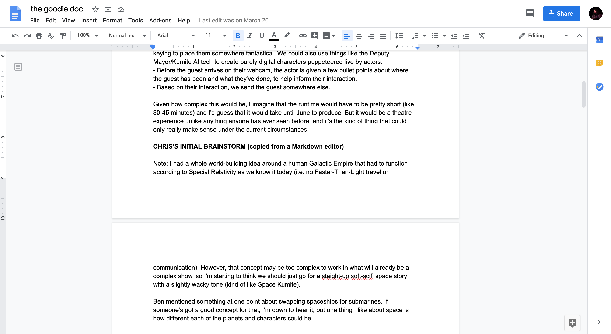

Crazy? It definitely would've been 10 years ago. But advances in the web platform (as well as the quality of cameras and hardware in mobile devices) took this down into the realm of "possible-if-slightly-quixotic".

Three months later, we've done it: Shattered Space is a piece of interactive theatre about a binary star system whose twin stars ("The Mothers") have disappeared. You and your fellow audience members are Star Jockeys, and have been conscripted to fly around in spaceships to get to know the denizens of the Matra System and see what you can do to help.

`youtube: https://www.youtube.com/embed/iifZPEHJM6c`

**Here's a trailer if you want a better idea of what's going on**

If you watched that trailer, you've probably figured out that this show involved 3D graphics (WebGL), videoconferencing (WebRTC) and perhaps also some music and audio processing (Web Audio). These were all technologies that I'd worked with on some level in the past, but this show required me to think about them completely differently. All because of the following central problem:

## Other People's Computers

`youtube: https://www.youtube.com/embed/nGt8w9RbhvY`

**This WebRTC-based monitoring system allowed the backstage band to see the stage in real time and take cues from actors. The onstage portal was rendered with WebGL. (*Welcome to Shakesville*, Baltimore Rock Opera Society 2019)**

I've used WebGL and WebRTC to build projection/video effects for a number of shows the past couple years, but in every case I was writing code that would only run on **my** computer. If I ran into a device-specific bug that affected my computer (or my iPhone, or my squad of Raspberry Pis) I had all the time and access I needed to either debug it or come up with a workaround. Not this time.

If someone pays us $15, receives the login link via email, tries to open it on a cheap 2014 laptop and it can't load without crashing, that's a refund. We weren't just messing around with advanced web features, we needed to deploy them in the most battle-hardened and resilient way possible, while also capturing just enough data and logs to pinpoint who was having problems and ideally solve them before the show started.

This meant going beyond the kinds of code you see in introductory tutorials and really digging into how these APIs deal with memory management, how they respond to connection issues, how they can fail, and how to tweak things at runtime to ensure that framerates stay high and dropped packets are few. I learned a lot about productizing these features, and I'd like to share as much of that as I can, but first let's talk basics.

## Basic Platform Overview

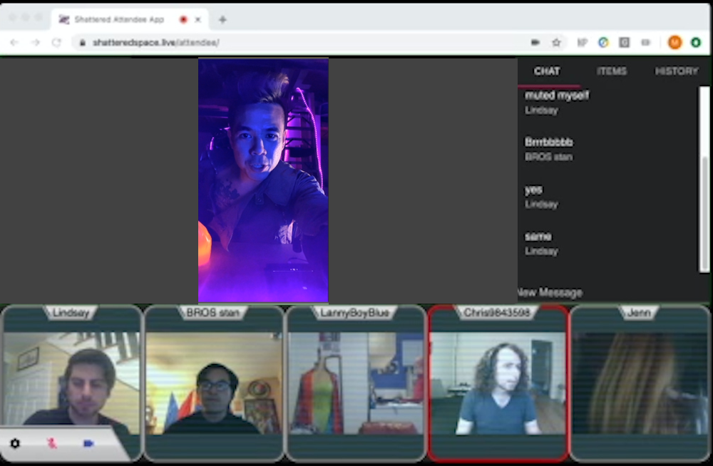

Attendees of Shattered Space are broken up into 6 groups of 5. Each group is assigned to a "ship" that flies around the system, and they interact with the characters in the show as a group. Attendees have the options to mute their microphone and turn off their camera if they wish (there is a text chat on the side they can use to communicate) although we encourage people to keep them on if they feel comfortable.

The Shattered Space platform consists of:

- An ExpressJS service that keeps track of the overall state of the show.
- 7 Janus WebRTC media servers. One for each ship and a extra for broadcasting a livestream of the ending scene.
- The Admin App, a React/Redux webapp that handles scheduling shows, keeping track of which actor is talking to which ship, and has real-time dashboards with logs of client-side errors and connectivity issues.
- The Actor App, a React/Redux webapp used by actors to interact with the audience via audio, video, text, and the giving/taking of items from a ship's inventory.
- The Attendee App, a React/Redux webapp where attendees view the show and interact with the actors and each other via audio, video and text.
- The Host App, used by me to perform the motion-captured ending scene.

When I say that the Show Service "keeps track of the overall state of the show", I mean *all* of the state. Most of the Redux actions (across all 3 apps) don't mutate the state of the reducers, but instead hit an endpoint on the Show Service that changes the state kept in the database, then fetches *all* of the state from the database and sends it to *all* of the users as a WebSocket message which then overwrites most of the reducers' state. This way, no client can end up with "orphan state" as a result of optimistically updating their reducer before their API call returns, and fetching the updated state for *all* users can be done with a single database call (this refresh-all-state-for-everyone method is debounced and implements a queueing mechanism to ensure we don't have too many database calls at once).

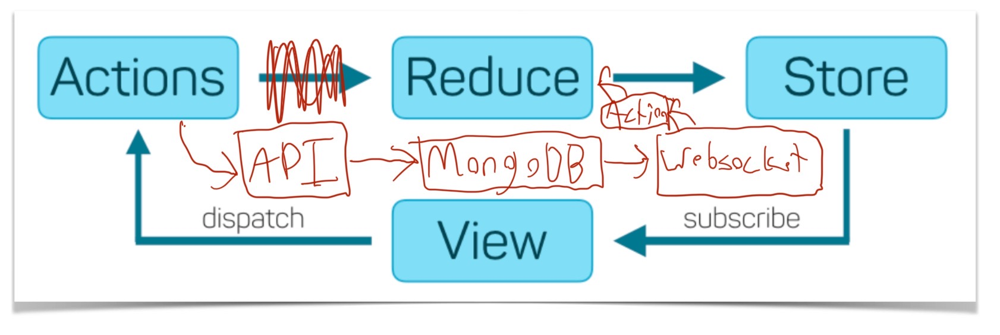

(I'd note that this architecture emerged sort of organicly and there are probably cleaner or more optimal ways of achieving this "Redux-but-the-server-is-the-reducer" architecture. I'm open to feedback on whether something like Relay or Meteor would be a better fit for a V2)

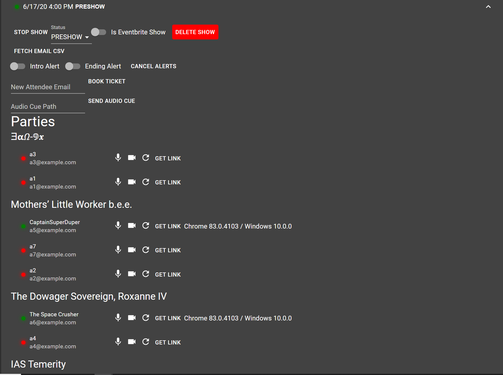

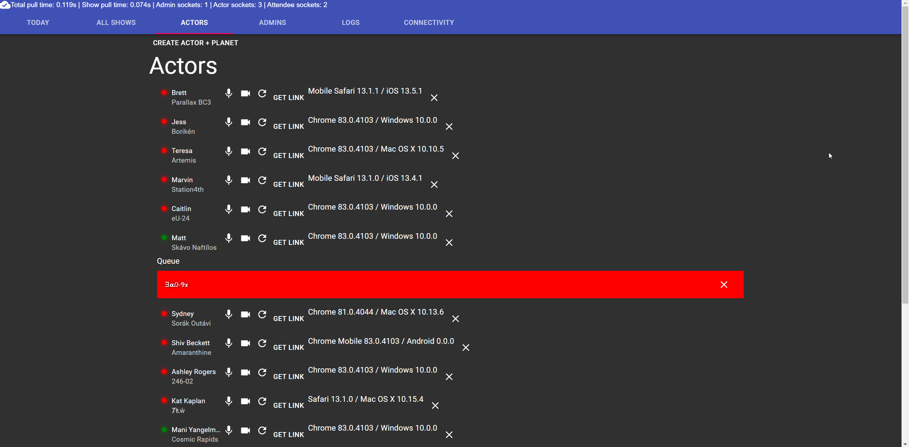

Of the 3 React/Redux apps, the Admin App uses the least of these shiny web technologies, and is pretty much just a dashboard for displaying what's in the database. As admins, we can see which actors and attendees have logged on, which ships are currently visiting which actors, we can move attendees between ships if need be, and we can see a list of errors the actors and attendees have encountered (more on this later).

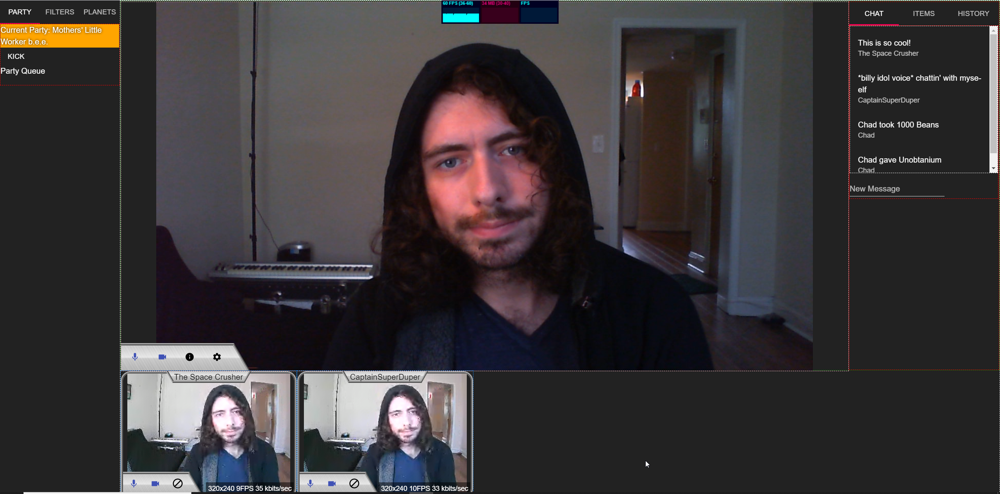

The Actor App is more sophisticated, since it needs to handle WebRTC and media device concerns. It also has 3 modes: Normal, Mobile (used automatically if the window has a dimension less than 500px) and Headless (used if the querystring variable `headless` is set to `true`. The Normal mode is used by about half of the actors, and has the ability for them to see themselves, configure their audio/video devices, change any info about their user, character or planet, and view information about the ships they're talking to (their chat, inventory, history of previous places, etc.).

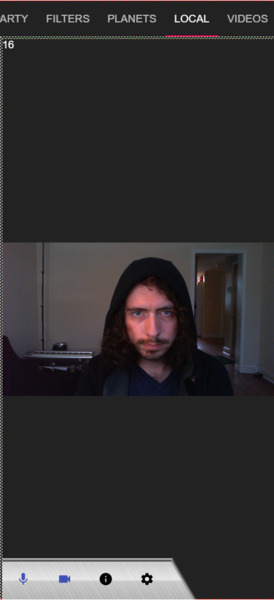

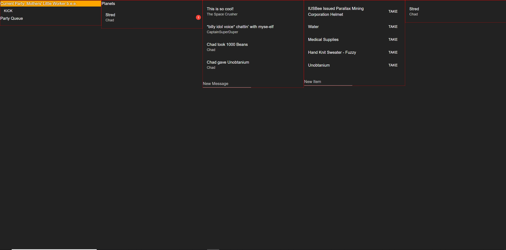

The Mobile mode uses a tab-based layout to try and accomplish all the same goals, but since only one tab can be on the screen at a time, it's a bit of a pain to use on its own. We've got Headless mode, which doesn't do any of the audio/video streaming, but shows all the information about the current ship and can run on any laptop. Many actors have opted for using the Mobile mode (since their phone has a good camera) but keeping Headless mode open on an old laptop to make it easier to use the other features.


The Attendee app is about as complex as the actor app, but doesn't have a Headless mode (which is really just a power-user feature for actors). This app has multiple screens corresponding to the different phases of the show:

- Preshow - A lobby screen where attendees can meet the shipmates they'll be flying with
- Intro - A tutorial video
- Freeplay - The bulk of the show, where attendees alternate between interacting with characters and choosing their next destination from the Navigation Screen
- Ending - A livestreamed 3D ending scene
- Ended - This just redirects attendees out of the app to [a static page with our casts' bios](https://shatteredspace.live/program.html).

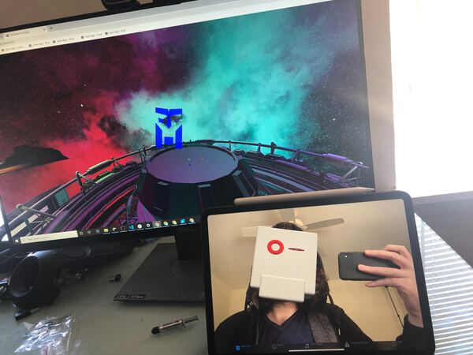

At the end of the show, I perform a scene as Colonel Panic, the AI commander of the Star Jockeys. In this scene I go around to each ship and review the items they've managed to collect. Then a "resolution" happens that I won't spoil here.

This performance is rendered on my desktop PC (Intel 8700K + RTX 2080TI) with a special version of the Actor app that I've built just for this purpose. The three.js scene here involves at least 7 huge models with MeshPhysicalMaterials and a dozen moving PointLights, so rather than rendering on attendees' computers, I render it on mine and stream it to them using an [Elgato Camlink 4K](https://www.elgato.com/en/gaming/cam-link-4k), ffmpeg and the Janus (explained below) [Streaming plugin](https://janus.conf.meetecho.com/docs/streaming.html).

The motion capture work is done by taking a modified version of Apple's [TrackingAndVisualizingFaces](https://developer.apple.com/documentation/arkit/tracking_and_visualizing_faces) example from the ARKit docs and having it send each frame of mocap data over WebSockets to the server, which then forwards them to the Host app. It's amazing that this works with sub-100ms latency, but it does.

I'm planning on open-sourcing all of this when the show is done, but I'd want to purge the git history in case there are any secrets lying around, and I'd warn any interested spelunkers that it will be more of an "interesting artifact to look at" than "a thing you could easily get running locally".

## WebRTC and Janus

As of this writing, the only plugin-free way to do real-time video conferencing in the browser is through WebRTC, a web standard for RealTime Communication that can handle streaming audio, video and even packets of arbitrary data. In tutorials, WebRTC is often demoed as a Peer-to-Peer communication tool, and it certainly *can* do that. But if you have 5 attendees in a room, then each one has to broadcast 4 audio/video streams (one for each other attendee) and receive 4 more streams. This can be tough on people who are having connectivity issues or are using mobile networks.

](../pages/images/shattered/mesh-vs-sfu.png)

Generally if you want to build a web-based video conferencing product, you'll want servers in the cloud that can multiplex these streams for you. That way, each attendee only has to send a single copy of their stream (they still have to receive the other 4, this can't be helped). The industry terms for these two approaches are "Mesh" vs. "Selective Forwarding Unit" (often abbreviated SFU).

There are a number of open source servers that can do this, and the one we used for Shattered Space is [Janus](https://janus.conf.meetecho.com/) by the team at [meetEcho](https://www.meetecho.com/en/). I was familiar with it from other projects, its maintainers have put in years of consistent work ([seriously **look** at this contributor graph](https://github.com/meetecho/janus-gateway/graphs/contributors)), and since it's written in C it's blazing fast and almost never hits double-digit CPU usage on a `t3a.nano` on EC2.

Janus not only multiplexes streams for you, it also has APIs that assist with a lot of the troublesome signalling and NAT-punching required to start a WebRTC session. All this is wrapped up in a client-side JS library with lots of [good](https://janus.conf.meetecho.com/echotest.html) [useful](https://janus.conf.meetecho.com/videoroomtest.html) [examples](https://janus.conf.meetecho.com/vp9svctest.html) that can serve as starting points for projects (if you're not getting it yet I really like this thing).

The two thorny issues I ran into revolved around the topics of the next two sections:

- Incorporating WebRTC into a Redux app
- Acquiring Media Devices

But other than those, Janus was great. I've never needed to randomly restart the servers because of memory leaks, the plugin system gives you tons of options for features, you can whip up a Docker image and deploy it in minutes. Seriously, check this thing out.

## WebRTC and Redux

Creating and maintaining a WebRTC PeerConnection is one of the most side-effecty things you can do on the front end. You've got:

- multiple kinds of errors, each with different error handlers (whose errors need to be handled in different ways based on their cause).
- multiple kinds of other events which create more stateful side-effecty stuff (like when a user joins the room, leaves the room, or toggles their mute switch)
- a lot of loose ends that need to be "cleaned up" or disposed of, like connection objects or streams from a local media device (we'll get to those in a moment)

I lack any notion of respect for my time, so naturally, I chose to build this app in Redux.

Joking aside, I really like Redux and the way that it lets me structure applications. I've used it for years (usually via [generator-react-webpack-redux](https://www.npmjs.com/package/generator-react-webpack-redux)) and have found it pretty adaptable to a number of projects. Nonetheless, one of its biggest weaknesses is around handling side effects. Usually I use the [`redux-thunk`](https://www.npmjs.com/package/redux-thunk) package to handle asynchronous or side-effecty processes, but for this one I decided to take a crack at [`redux-saga`](https://redux-saga.js.org/). This was a good choice.

Redux Saga takes a bit of time to get your head around (unlike the rest of the JS world, it hopped off the async/await train and onto the generators one). But once you do you'll find that it is capable of creating abstractions that Promises and async/await could only dream of, like [event channels](https://redux-saga.js.org/docs/advanced/Channels.html#using-the-eventchannel-factory-to-connect-to-external-events), [cancellable async tasks](https://redux-saga.js.org/docs/advanced/TaskCancellation.html) and even ["forked" processes](https://redux-saga.js.org/docs/advanced/ForkModel.html) within the single threaded event loop. It's great for times like this where you need to spin something up in response to an action, inhale any actions it puts out, and clean up when you're done with it. I intend to write a more detailed article about using Redux Saga in WebRTC apps, because they're a pairing that was made for each other.

## Acquiring Media Devices

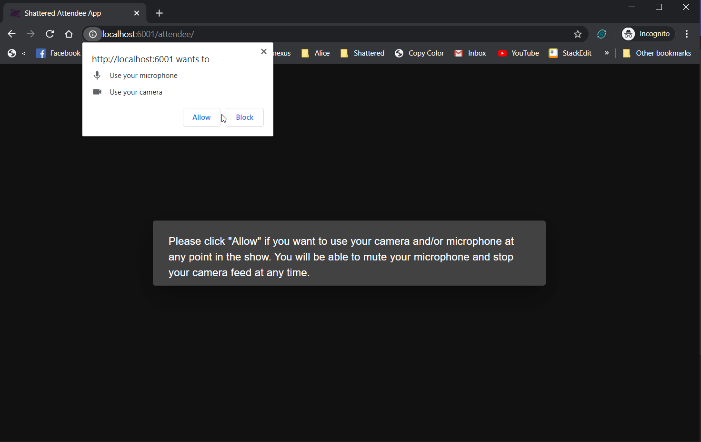

Despite being the topic of [numerous](https://www.html5rocks.com/en/tutorials/getusermedia/intro/) [introductory](https://flaviocopes.com/getusermedia/) [WebRTC](https://www.sitepoint.com/introduction-getusermedia-api/) [tutorials](https://www.html5rocks.com/en/tutorials/webrtc/basics/), the hardest part of this app was just getting the user's camera and microphone in the first place. Sure, 80% of the time it's as simple as going <code>await navigator.mediaDevices.getUserMedia({ audio: true, video: true })</code>, and then if the user deems your application worthy you receive a [`MediaStream`](https://developer.mozilla.org/en-US/docs/Web/API/MediaStream) that you can view in a `<video>` element, send over an [`RTCPeerConnection`](https://developer.mozilla.org/en-US/docs/Web/API/RTCPeerConnection), etc. And while that's basically true, if you're building a real production app there are a number of other concerns you need to account for.

First of all, if the user denies your request for camera, microphone or both, you need a way to gracefully fallback without reducing too much functionality. In our case, we politely ask users to allow us to use their microphone and camera and let them know that they can turn them on or off at any time in the show. But if they don't trust us and want to do the whole show via text chat (while viewing and hearing their shipmates and the actors) we make sure to let them do that too. This makes things complicated (in part because we try to detect if the user has allowed camera-but-not-microphone and vice-versa) but we're only scratching the surface.

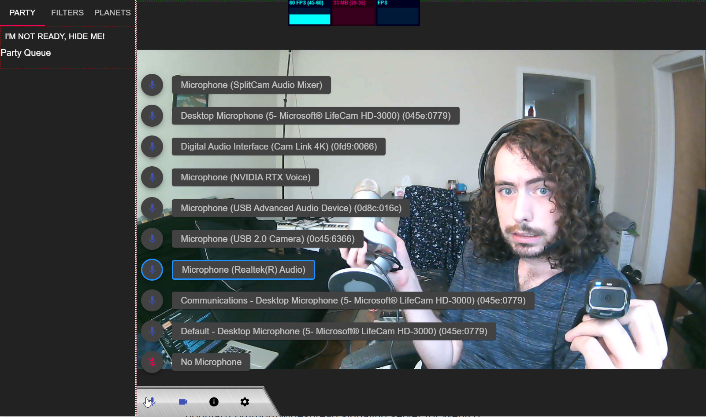

The default video and audio sources available to `getUserMedia` may not be the ones the user intends to use. For instance, a user might have:

- a good USB microphone, and a Bluetooth headset with a bad microphone (but which was set up more recently and is the browser's default mic).
- a good USB webcam mounted on their monitor, and a built-in webcam on their laptop which is running in "clamshell mode" (but which the browser chooses as the default)
- a good USB webcam that "hangs" when you try to access it... because it is being used by a webcam filter app like SplitCam which presents its own pseudo-video device you should be using instead
- a capture card or similar device which presents as a webcam but actually just shows what's on the user's monitor.

So naturally you'll want to make a selector that allows users to choose which device to use (or to use no device at all). For that you'll need [`navigator.mediaDevices.enumerateDevices()`](https://developer.mozilla.org/en-US/docs/Web/API/MediaDevices/enumerateDevices), which returns a complete list of the user's available devices, their user-readable labels, and the deviceIds you can use to request their feeds, all without prompting the user for permisson.

"Wait what?"

Well, if the user hasn't granted permission (or hasn't been asked) you'll get back a list containing only the default audio and video devices, their groupIds (but not deviceIds) and no labels. This is to prevent fingerprinting, and is all well and good because you can figure out if you've prompted the user for mic/camera access by calling [`navigator.mediaDevices...uhoh there's no way to do this`](https://www.youtube.com/watch?v=dQw4w9WgXcQ).

So, as our app is booting up, our logic for getting a list of available devices looks like this:

``` js
  try {
    // After this we'll know for SURE whether we've asked permission
    let stream = await navigator.mediaDevices.getUserMedia({
      video: true,
      audio: true
    });
    // But these might not be the devices we actually want,
    // so dump this stream and wait for the user to select a device
    stream.getTracks().map(track => {
      stream.removeTrack(track);
      track.stop();
    });

    // If we've made it this far, we know we'll get "the good list"
    let devices = await navigator.mediaDevices.enumerateDevices();
  } catch(e) {
    console.log(`Error getting input devices: ${e.message}`);
  }
```

That's right: We acquire a stream (and hope the default media devices are available and don't hang) and then if we get one (meaning we've got permission and can get the real device list) we immediately dump the stream and then get a list of the devices. Of course, it's more complicated--if we fail at getting the stream we test trying to get the camera and microphone individually and then use those results (after dumping the streams) to figure out what permissions the user has given us--but like the Saga/WebRTC integration, this topic probably also deserves it's own article.

But I'm going to go on a bit longer: You will need to become *intimately* familiar with each browser+OS combo's unwritten rules around device access and occasional "bad habits". Things like:

- On iOS: only one application can have camera access at a time, so if the user just got off a Zoom call but forgot to close it, you'll get an error when trying to pull a media stream even if the user has previously given your app permission
- On iOS: the Safari App, Safari standalone PWAs, and SafariViewControllers can all use WebRTC. UIWebViews and WKWebViews cannot, and `navigator.mediaDevices` is actually undefined. This means Chrome for iOS does not support WebRTC, but if you open a link from Slack or a modern email app, that WebView actually *can* use WebRTC. This is for security reasons, and is an improvement over the old days of "the Safari App or bust", but I do wish Apple and Google could figure out a way for this to work in Chrome for iOS.
- In general: You'll often come across unhelpful errors like "unable to find device" or "video source failed to start". These could mean almost anything, but I've often found that switching to "no input" for a few seconds and back to the device again can fix it, as can unplugging and replugging the device if it's over USB. This is a hard one to diagnose remotely, and is a real stinker.
- Regarding webcams in general: Bear in mind that a webcam generally starts recording in a particular resolution and framerate, and if another app or page requests that same camera with a different resolution or framerate, it'll be like "I'm already recording, you're gonna get what you're gonna get". Webcams generally can't take their sensor input and transform it into different forms for different apps. I recommend getting 2 cheap webcams from different manufacturers to make testing easier and coverage better.

And finally I will note a few more things that developers working with media devices need to be aware of:

- If you're going to implement this sort of device switching (and it's pretty mandatory UX for a consumer video app) it means you can't rely on libraries like Janus.js to handle this stuff for you. You'll need to acquire the `MediaStream` yourself and hand it to your WebRTC library, rather than just telling the library "use video but not audio for this one".
- When you switch devices, it's not as simple as swapping a MediaTrack in your MediaStream with a MediaTrack from your new MediaStream, as doing so will cause the old MediaTrack to fire an `ended` event which will kill your RTCPeerConnection. Since there isn't a (working cross-platform as of 6/2020) `MediaStream.replaceTrack()` method, you pretty much have to teardown all your WebRTC stuff and reconnect any time something about the media device changes. Making this operation easy to perform and leak-proof will be important, because you will need to do it a lot.
- One workaround for the above is to pass all audio through the Web Audio API and all video through a canvas element and use `.captureStream()` to create a video track from the canvas element that never "ends". But unless the user has a fairly beefy computer (and isn't in Safari) this won't work well.

## three.js and OffscreenCanvas

<video style="max-width: 100%" src="https://cdn.chrisuehlinger.com/show-videos/planet-selection.mp4" muted autoplay loop />


After viewing a short intro/tutorial video, the attendees find themselves on the Navigation Screen. This is where they choose which planet, space station, or other destination they want to go to next. Any member of the group can select a destination for them all to look at, and one member (randomly chosen each time) gets to select which planet to go to. This consists of two main components:

- A list UI for making selections and a button for confirming the selection.
- A canvas showing a three.js-rendered view of the destination

Like a lot of the situations in this post: I'd used three.js before, but usually in cases where the 3D piece basically *was* the page. In this instance, I was building a 3D scene *into* an app that had a lot of other functionality. So let's say a user is on an underpowered device but is running Chrome, and they're rendering the scene at 1 FPS or worse. We want to make sure they can still click the buttons in the UI and have them respond in a timely manner.

So how do you solve a problem you created using advanced web tech? Obviously, by throwing even more web tech at it.

[`OffscreenCanvas`](https://developer.mozilla.org/en-US/docs/Web/API/OffscreenCanvas) is a Web API that allows you to perform costly rendering work in a Web Worker, separate from the main UI thread. Now granted, it doesn't completely solve the problem (if your rendering tanks to 25FPS, it'll take the main thread's FPS down about as far) but it does prevent two big problems:

- Errors thrown in the Web Worker are contained and won't impact the main thread (just kill the 3D animation).
- Sometimes the three.js scene totally locks up its thread (when compiling shaders or loading a complicated model) and in those times, the UI stays responsive.

But it also brings new problems of its own, so watch out for these:

- Safari doesn't support `OffscreenCanvas`, so you'll need a polyfill that will allow you to run all your code on the main thread if need be. I recommend [`offscreen-canvas`](https://github.com/ai/offscreen-canvas) as a good starting point, but I adapted it for my own uses to better support having multiple canvas workers who can be sent new canvases as need be.
- If you're using webpack, you'll need to make a new entrypoint for your worker code and you'll want to make a `<link rel="preload">` tag so your polyfill can find the name of your worker script and load it on the appropriate thread. Check out [`preload-webpack-plugin`](https://www.npmjs.com/package/preload-webpack-plugin).
- If you're using three.js, you'll need to make sure it never tries to create/modify DOM elements when running in a WebWorker. You'll need to pass a `false` flag into `renderer.setSize()` so it doesn't try and modify the canvas's style, and you'll need make your own versions of loaders like [`TextureLoader`](https://github.com/mrdoob/three.js/blob/master/src/loaders/TextureLoader.js) and [`FBXLoader`](https://github.com/mrdoob/three.js/blob/master/examples/jsm/loaders/FBXLoader.js) using [`ImageBitmapLoader`](https://three.js.org/docs/index.html#api/en/loaders/ImageBitmapLoader) under the hood instead of [`ImageLoader`](https://three.js.org/docs/index.html#api/en/loaders/ImageLoader). This is mostly a drop-in replacement, but make sure to read up on how `ImageBitmapLoader` differs from `ImageLoader` (on things like `.flipY`) and adapt accordingly.

## three.js and Memory Management

The other new problem was memory management: Simply letting three.js objects fall out of scope isn't enough to truly garbage collect them, because three.js keeps a registry of data in the background to improve performance (given how WebGL works, this is understandable).

Classes that require [disposal](https://three.js.org/docs/index.html#manual/en/introduction/How-to-dispose-of-objects) have a `.dispose()` method. I basically mirrored this in my code: I created a class for each "thing" in my scene, with a constructor that loaded all the models and textures (adding them to a `this.disposables` array as it went), a `.update()` method for any animations, and a `.dispose()` method that would call `.dispose()` on all of the disposables and handle any other necessary cleanup.

``` js
export default class TLW {
  constructor(globals, options) {
    this.globals = globals;
    this.disposables = [];

    (new FBXLoader(globals.loadingManager))
      .setPath(`${config.ASSET_PATH}/planets/TLW/`)
      .load( `fighter_low.fbx`, ( object ) => {
        object.traverse(( child ) => {
          if ( child.isMesh ) {
            // Add each loaded geometry to the disposables list
            this.disposables.push(child.geometry);
            // Don't forget their materials
            this.disposables.push(child.material);
            // Or their textures
            this.disposables.push(child.material.map);
          }
        } );

        this.group.add( object );
      });

    this.group = new THREE.Group();
    this.group.position.set(...options.position);
    this.options = options;
  }

  dispose() {
    this.globals = null;
    this.disposables.map(asset => {
      // Wrap this in a try/catch and announce in the console if we
      // try to dispose of something that doesn't need to be
      try {
        asset.dispose();
      } catch (e){
        console.error('DISPOSAL ERROR', asset);
        console.error(e);
      }
    });
  }
}
```
**A simplified version of the code used to load ȾⱠẘ, a ship stranded in space**

I'd estimate this is about 60-70% of the effort required to perfectly memory manage a complicated scene, and lets about 5-10% of leaks through (Don't ask me for my data I have none). The biggest loophole left is that if I instantiate one of my classes, it starts loading some models/textures and then gets destroyed before those assets load, they will load, have nowhere to go, and then leak. In practice this didn't happen often, and crashes due to memory usage appear fairly rare, and so I'm satisfied with this approach for this project.

I later obviated the need for most of this by persisting my three.js scene even when it's not on screen and just rebuilding/destroying the renderer whenever React mounted/unmounted the NavigationScreen component. This made loading the scene (after the initial load) near instantaneous, and meant there weren't as many possible places for memory leaks.

And finally, I'll note with a bit of shame that I cut the three.js entirely on mobile devices (crudely defined as a device with a dimension under 500px) since at that point, the list UI took up the entire screen.

## Detecting and Solving Issues Remotely

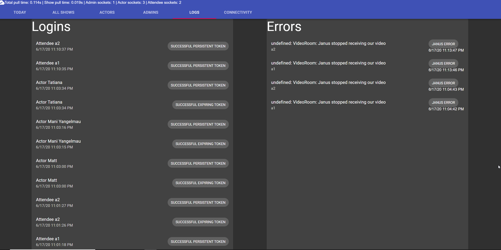

In general, we've seen that attendees log on 5-10 minutes before their show is scheduled to start. That means if they're having issues, we have 5-10 minutes to solve them.

This requires a multi-faceted approach with interventions at many points in the process:

- Our marketing material and login link email recommend using Google Chrome (though it is not strictly required) but also that if you're on iOS you must use Safari (no other iOS browsers can work with WebRTC).
- Our tech support team monitors our company email, which is used to send people their login links. This is the main way people reach out to us when they have problems, in part because:
- Any unrecoverable errors in the app are caught by a [React Error Boundary](https://reactjs.org/docs/error-boundaries.html) which then renders an error page with the error's message and a mailto link to our email so they can reach out to us directly.
- At show time, if we have attendees who haven't logged on, our tech support team reaches out via email to see if they're having login issues.
- Assuming users haven't turned our telemetry off, we will get immediate notification of any errors (recoverable or not) thrown by the actor and attendee apps. The tech support folks can use those to figure out what troubleshooting steps to email the user (often as simple as "refresh", "update your browser" or "turn your mic off and then on"). These error logs are not persisted to the database (they're sent straight to the Admin app and disappear on refresh).

I've got to give shout outs to our stage manager Liz Richardson, marketing director Donna Ibale and marketing intern Mark Uehlinger (my brother) who act as our crack tech support team, and do a lot of the stuff I just described. Solving technical issues in under 5 minutes for remote users who can only communicate via email is no small task. To the extent that the audience gets in and has a good time, it's in large part thanks to their diligent effort and quick action.


## Come See Shattered Space!

As of writing we have two weekends left of this show. One thing I may have forgotten to mention is that this show is **absolutely stacked**: we've got a bunch of the best actors in the Baltimore theatre scene and even actors from New York and Boston (since we're not bound by location). You can attend this show from anywhere in the world from the comfort of your living room!

<h3 style="text-align: center; font-weight: bold; margin:0 auto 15px;">
  <a href="https://shatteredspace.live" target="_blank">Tickets are available HERE!</a>
</h3>


<ShatteredCards />